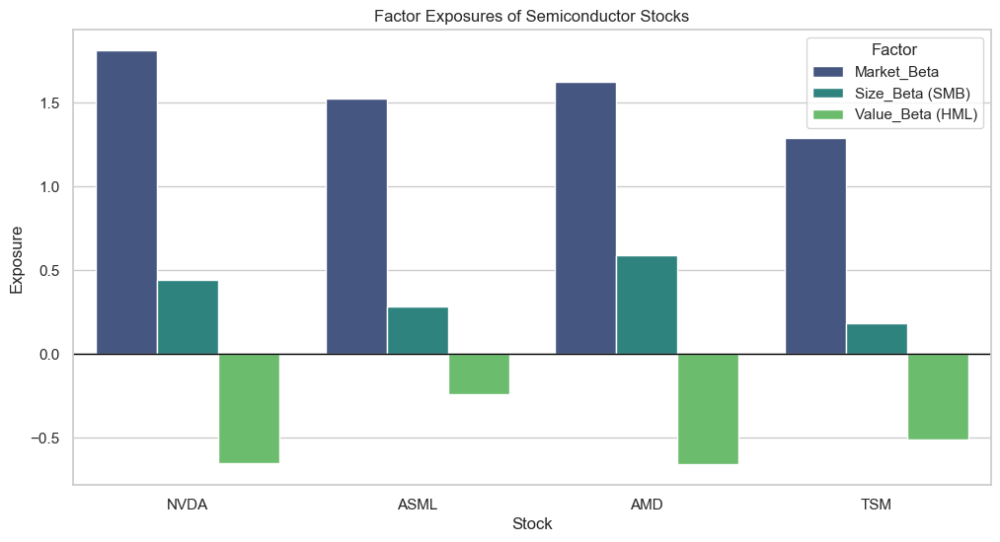

# Factor-Exposure Analyzer (Fama-French 3-Factor Model)

Bu proje, yarı iletken ve yapay zeka altyapısı sektöründeki seçili hisse senetlerinin (NVDA, ASML, AMD, TSM) piyasa faktörlerine olan duyarlılığını analiz etmek için geliştirilmiş bir **Finansal Veri Bilimi** aracıdır.

## Proje Amacı
Hisse senedi getirilerinin hangi faktörler (Market Risk, Size, Value) tarafından domine edildiğini Çoklu Doğrusal Regresyon (OLS) kullanarak tespit etmek.

## Kullanılan Teknolojiler
- **Python 3.x**
- **Pandas & Numpy:** Veri manipülasyonu ve işleme.
- **Statsmodels:** OLS Regresyon analizi ve istatistiksel metrikler.
- **Matplotlib & Seaborn:** Finansal görselleştirme.

## Dosya Yapısı
- `Factor_Exposure_Analyzer.ipynb`: Tüm analiz sürecini (Veri üretimi -> Regresyon -> Görselleştirme) içeren ana dosya.
- `requirements.txt`: Projenin çalışması için gerekli Python kütüphaneleri.
- `.gitignore`: Gereksiz dosyaların (mock veri setleri, cache vb.) repoya girmesini engeller.

## Nasıl Çalıştırılır?
1. Repoyu klonlayın:
   ```bash
   git clone https://github.com/kullanici_adi/factor-exposure-analyzer.git
   ```
2. Gerekli kütüphaneleri yükleyin:
   ```bash
   pip install -r requirements.txt
   ```
3. Jupyter Notebook'u başlatın ve tüm hücreleri çalıştırın.

## Analiz Çıktıları
Analiz sonucunda her hisse için Beta katsayıları hesaplanır ve görselleştirilir. Özellikle teknoloji hisselerinin yüksek Market Beta ve negatif Value (HML) duyarlılığı (Growth odaklı olmaları sebebiyle) net bir şekilde gözlemlenebilir.


